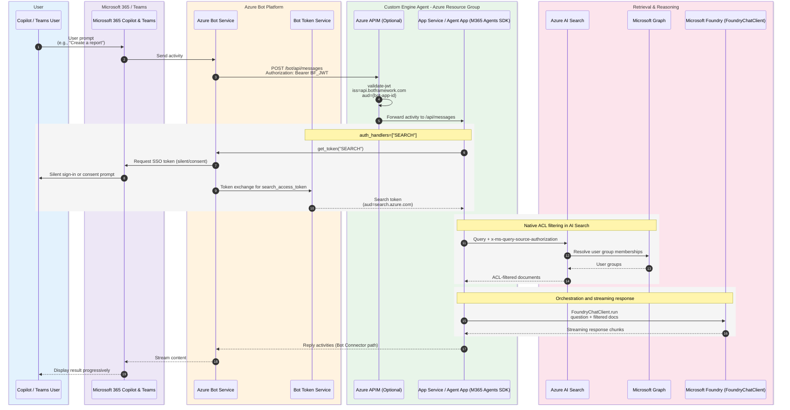
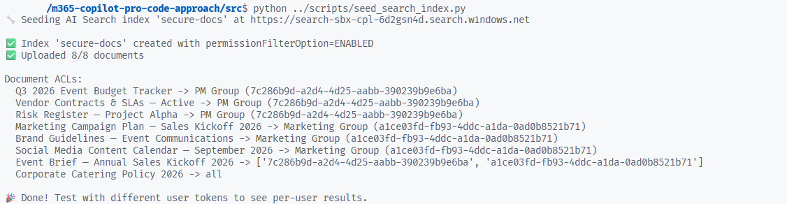
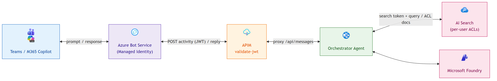
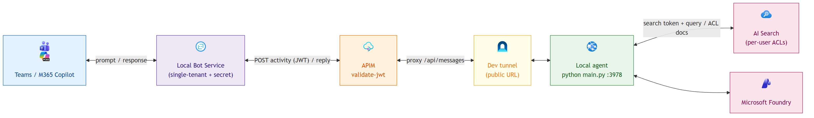
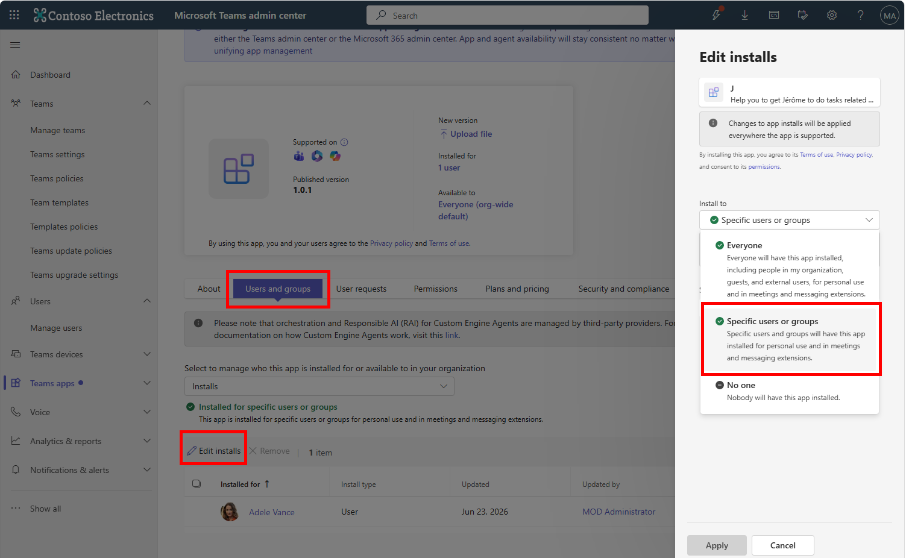

# M365 Copilot Pro Code Approach

## Disclaimer

This sample scripts are not supported under any Microsoft standard support program or service. The sample script is provided AS IS without warranty of any kind. Microsoft further disclaims all implied warranties including, without limitation, any implied warranties of merchantability or of fitness for a particular purpose. The entire risk arising out of the use or performance of the sample scripts and documentation remains with you. In no event shall Microsoft, its authors, or anyone else involved in the creation, production, or delivery of the scripts be liable for any damages whatsoever (including, without limitation, damages for loss of business profits, business interruption, loss of business information, or other pecuniary loss) arising out of the use of or inability to use the sample scripts or documentation, even if Microsoft has been advised of the possibility of such damages.

## Architecture

This project is an M365 Agent Application built with Python, M365 Agent SDK and the Microsoft Agent Framework, deployable to Azure using the Azure Developer CLI (`azd`). It demonstrates how to build a secure enterprise agent with per-user document access control through Azure AI Search and Entra security groups.




## Prerequisites

### Option 1: Use the DevContainer (recommended)

1. Install [Visual Studio Code](https://code.visualstudio.com/download) and the [Remote - Containers extension](https://marketplace.visualstudio.com/items?itemName=ms-vscode-remote.remote-containers).

2. Open the project in VS Code and click "Reopen in Container" when prompted. This will set up a development environment with all dependencies installed.

### Option 2: Install dependencies locally

- [Azure Developer CLI (azd)](https://learn.microsoft.com/azure/developer/azure-developer-cli/install-azd)
- [Azure CLI](https://learn.microsoft.com/cli/azure/install-azure-cli)
- [Python 3.13+](https://www.python.org/downloads/)
- [uv](https://docs.astral.sh/uv/)
- [Dev Tunnel](https://learn.microsoft.com/en-us/azure/developer/dev-tunnels/get-started?tabs=linux)
- An Azure subscription with access to Microsoft Foundry, AI Search, and API Management
- A Microsoft 365 tenant with Teams/Copilot access, admin access to validate the application in the tenant.

## Authentication

Before provisioning or deploying, authenticate with Azure:

```bash
az login --use-device-code
azd auth login --use-device-code
```

## Deploy infrastructure

At the **root** of the project, run the following commands to provision and deploy the application to Azure:

```bash
azd provision
```

This provisions all Azure resources (App Service, Bot Service, API Management, AI Search, Microsoft Foundry, app registrations, OAuth connections) and deploys the Python application.

## Populate AI Search index

### Generate local environment variables

To be able to test the application, you need to populate the Azure AI Search index with sample documents. First, generate the local environment variables by running the following command:

```bash
./scripts/gen_local_env.sh 
```

This will create a `.env` file at the root of the project with the necessary environment variables. Then, run the following command to populate the AI Search index:

### Install dependencies

```bash
cd src
uv sync
```

### Activate the virtual environment

Source the virtual environment to activate it, so the dependencies installed in the virtual environment are used instead of the system-wide Python packages:

```bash
source .venv/bin/activate
```

### Populate the AI Search index

This project uses Azure AI Search with Entra group-based document permissions. To set it up, you need to create an Entra security group and add users to it. Then, you can seed the AI Search index with demo documents that have restricted access based on the group membership. If you already have an Entra group and users, you can skip the group creation step and just add users to your existing group.

#### Create one Entra security group and add users

This section shows how to create one demo group and add users. You can use an existing group if you already have one. Replace `<group-id>` and `<user-object-id>` with the actual IDs.

```bash
az ad group create --display-name "Contoso-RestrictedDocs" --mail-nickname "contoso-restricteddocs"
# Add your users to the Entra ID group
az ad group member add --group "<group-id>" --member-id "<user-object-id>"
```


### Seed the AI Search index with demo documents

For simplicity, you will use the same `.env` file used by the bot. The `seed_search_index.py` script reads the group ID from `.env` and uses it to set restricted document permissions. Public documents are tagged with `group_ids=["all"]`.

Inside the `.env` update the `CONTOSO_GROUP_RESTRICTED_DOCS_ID` variable with your Entra group Object ID you created or reused.

Then from the **root** of the project, run the following command to seed the AI Search index with demo documents:

```bash
cd .. # Go back to the root of the project
python ./scripts/seed_search_index.py
```

You should see something like this:



## Run the application

You have 2 modes to run the application: 
- Production mode (deployed to Azure, real SSO + per-user ACLs)
- Development / Debug mode (local Bot Service + Dev tunnel)

### Production vs Development / Debug configuration

Each mode has its **own** bot identity **and its own SSO app registration** (federated
credentials, user sign-in, per-user Search ACLs); they only share the **same APIM gateway**.
What changes is **where the agent runs** and **which bot identity** fronts it. The
development mode adds a dedicated, single-tenant bot identity because a laptop cannot use
the managed identity that the deployed app relies on.

| Aspect | Production | Development / Debug |
|---|---|---|
| Where the agent runs | Azure App Service (Linux) | Your machine, exposed through a dev tunnel |
| Bot identity | User-assigned managed identity | Dedicated single-tenant app registration |
| How the bot proves its identity to Bot Service | Managed identity (no secret) | Client secret (minted locally) |
| Azure Bot Service resource | Production bot | Separate local bot |
| Messaging endpoint chain | APIM App Service | APIM dev tunnel local agent |
| Teams manifest bot id | Production bot identity | Local bot app registration |
| User sign-in (SSO) app | Production SSO app (federated credentials) | Dedicated local SSO app (federated credentials) |
| Per-user Search token | OAuth connection on the production bot (production SSO app) | OAuth connection on the local bot (local SSO app) |
| Microsoft Foundry access | Managed identity | Your developer sign-in (`az login`) |
| Typical use | Real tenant rollout | Breakpoints and fast iteration |

> The Teams manifest's bot id must always match the Microsoft App ID configured on the
> Azure Bot Service it targets. In production that is the managed identity; in development
> it is the local single-tenant bot app registration. The SSO entry in the manifest
> (`webApplicationInfo`) points to the **production** SSO app in production and to the
> **dedicated local** SSO app in development — each environment is self-contained.

### Production Mode



<!-- Diagram source: docs/architecture-production.mmd (regenerate the PNG with mermaid-cli) -->


First, run the following command to deploy the application to Azure:

```bash
azd deploy
```

The deployment must take few minutes, if it takes longer than 5 minutes cancel the deployment and run the command again. 

When it's deployed you must generate the manifest package to upload to the admin Teams portal.

#### 1. Create the Teams app id (one-time)

The Teams app id is a unique GUID identifying the app in the catalog. **Keep it stable** so future version bumps update the same app instead of creating a new one. Store it once in the azd environment:

```bash
# Only set it if it isn't already stored (idempotent)
azd env get-values | grep -q '^TEAMS_APP_ID=' || azd env set TEAMS_APP_ID "$(cat /proc/sys/kernel/random/uuid)"
```

- To force a brand-new id later: `azd env set TEAMS_APP_ID "$(cat /proc/sys/kernel/random/uuid)"`.

> Tip: run `export AZD_SKIP_UPDATE_CHECK=true` so azd's "update available" banner doesn't pollute `azd env get-value` output in scripts.

#### 2. Build the manifest package

```bash
./scripts/build_manifest.sh \
  --app-version "1.0.0" \
  --teams-app-id "$(azd env get-value TEAMS_APP_ID)" \
  --bot-id "$(azd env get-value BOT_ID)" \
  --domain "$(azd env get-value APIM_DOMAIN)" \
  --app-uri "$(azd env get-value SSO_APP_ID_URI)" \
  --app-id "$(azd env get-value SSO_APP_ID)" \
  --short-name "YourAgent" \
  --full-name "YourAgent" \
  --zip appPackage.zip
```

This will create the `appPackage.zip` file ìn the `appPackage/build` folder.

Now follow the [Upload the app to Teams](./README.md#upload-the-app-to-teams) section

## Deploy to Teams and M365 Copilot

### Development / Debug Mode

To run the application in development/debug mode, you need to set up a dev tunnel and run the local agent. 



<!-- Diagram source: docs/architecture-development.mmd (regenerate the PNG with mermaid-cli) -->


First, run the following command to login to the dev tunnel:

```bash
devtunnel user login -d
```

Then run the dev tunnel script to create a persistent dev tunnel for port 3978 and host it. This will write the `LOCAL_TUNNEL_ENDPOINT` to the azd environment. Leave it running in the background.

```bash
./scripts/devtunnel.sh
```

In a **new terminal** reprovision the Azure resources to update the local bot and APIM backend to use the dev tunnel endpoint:

```bash
azd provision
```

Generate src/.env for the local run. Mints the local bot client secret with your az identity (cached in the azd env) and pulls Foundry/Search values from the outputs.

```bash
./scripts/gen_local_env.sh
```

Finally, you can run the project locally by running the following command:

```bash
cd src && uv run python main.py
```

The teams app id is a unique GUID that you must keep to be able to update the app in the future. 

#### 1. Create the dev Teams app id (one-time)

The dev app is a **distinct** Teams app, so it uses its own GUID stored as `TEAMS_APP_ID_DEV`:

```bash
# Only set it if it isn't already stored (idempotent)
azd env get-values | grep -q '^TEAMS_APP_ID_DEV=' || azd env set TEAMS_APP_ID_DEV "$(cat /proc/sys/kernel/random/uuid)"
```

- To force a brand-new id later: `azd env set TEAMS_APP_ID_DEV "$(cat /proc/sys/kernel/random/uuid)"`.

#### 2. Build the dev manifest package

```bash
./scripts/build_manifest.sh \
  --app-version "1.0.0" \
  --teams-app-id "$(azd env get-value TEAMS_APP_ID_DEV)" \
  --bot-id "$(azd env get-value LOCAL_BOT_ID)" \
  --domain "$(azd env get-value APIM_DOMAIN)" \
  --app-uri "$(azd env get-value LOCAL_SSO_APP_ID_URI)" \
  --app-id "$(azd env get-value LOCAL_SSO_APP_ID)" \
  --short-name "YourAgentDev" \
  --full-name "YourAgentDev" \
  --zip appPackage.dev.zip
```

Then, to be able to test you must upload the app package to Teams. Follow the [Upload the app to Teams](./README.md#upload-the-app-to-teams) section.

## Upload the app to Teams

To upload the app to Teams, follow these steps:

Open [https://admin.teams.microsoft.com/policies/manage-apps](https://admin.teams.microsoft.com/policies/manage-apps) and sign in with your Microsoft 365 account.

Upload the `.zip` file you created in the previous step:


Then give acces to your testing user or group:



By picking only one group or user, the propagation of the app will be faster.

## Update an existing app

When the app is already uploaded in the Teams admin center, keep the same Teams app id and only rebuild the package with a higher `--app-version`. Use `TEAMS_APP_ID` for the production app and `TEAMS_APP_ID_DEV` for the development/debug app; changing this id creates a new app instead of updating the existing one.

Open the existing app from **Teams apps > Manage apps**, then use **Upload file** in the **New version** section and select the new `.zip` package. This updates the same catalog app for both Teams and Microsoft 365 Copilot, while keeping the current user or group assignment.


## References

- [M365 Agents SDK](https://learn.microsoft.com/microsoft-365/agents-sdk/agents-sdk-overview)
- [Agent Framework (Python)](https://github.com/microsoft/agent-framework)
- [AI Search Document-Level ACLs](https://learn.microsoft.com/azure/search/search-document-level-access-overview)
- [Query-Time ACL Enforcement](https://learn.microsoft.com/azure/search/search-query-access-control-rbac-enforcement)
- [Bot Connector Authentication](https://learn.microsoft.com/azure/bot-service/rest-api/bot-framework-rest-connector-authentication)
- [APIM validate-jwt Policy](https://learn.microsoft.com/azure/api-management/validate-jwt-policy)
- [Azure Architecture Icons](https://learn.microsoft.com/azure/architecture/icons/)
- [Microsoft 365 Architecture Icons](https://learn.microsoft.com/previous-versions/microsoft-365/solutions/architecture-icons-templates)
