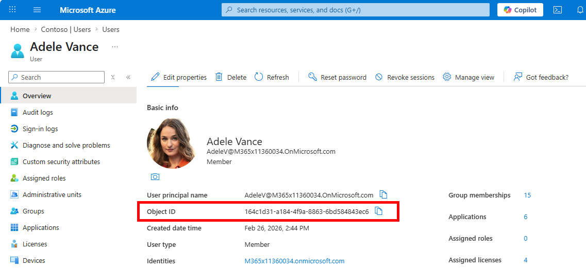

# Populate AI Search Index

## Local Development

### Install dependencies

```bash
cd src
uv sync
```

### Activate the virtual environment

```bash
source .venv/bin/activate
```

### Run the application

```bash
uv run python main.py
```

## Per-user document access control

This project uses Azure AI Search with Entra group-based document permissions. To set it up:

### Create one Entra security group and add users

This section shows how to create one demo group and add users. You can use an existing group if you already have one. Replace `<group-id>` and `<user-object-id>` with the actual IDs.

```bash
az ad group create --display-name "Contoso-RestrictedDocs" --mail-nickname "contoso-restricteddocs"
# Add your users to the Entra ID group
az ad group member add --group "<group-id>" --member-id "<user-object-id>"
```



### Seed the AI Search index with demo documents

For simplicity, you will use the same `.env` file used by the bot. The `seed_search_index.py` script reads the group ID from `.env` and uses it to set restricted document permissions. Public documents are tagged with `group_ids=["all"]`.

Inside the `.env` update the `AZURE_SEARCH_ENDPOINT` variable with your Azure AI Search endpoint. You can find it in the Azure portal under your Azure AI Search resource.


Then inside your `.env` update `CONTOSO_GROUP_MARKETING_ID` with your Entra group Object ID:

```bash
python scripts/seed_search_index.py
```

1. **Sideload the app in Teams/Copilot:**

Upload the manifest from `appPackage/` in Teams → Apps → Manage your apps → Upload a custom app.

## Configuration

All configuration is via environment variables. See [`.env.template`](../.env.template).

| Variable | Description | Set by |
|----------|-------------|--------|
| `CONNECTIONS__SERVICE_CONNECTION__*` | Bot identity (UAMI) | `azd provision` |
| `AGENTAPPLICATION__USERAUTHORIZATION__HANDLERS__SEARCH__*` | Search token handler | `azd provision` |
| `AZURE_SEARCH_ENDPOINT` | AI Search endpoint | `azd provision` |
| `MS_FOUNDRY_PROJECT_ENDPOINT` | Foundry project endpoint | `azd provision` |
| `CONTOSO_GROUP_MARKETING_ID` | Entra group ID for restricted documents | Manual (`.env`) |